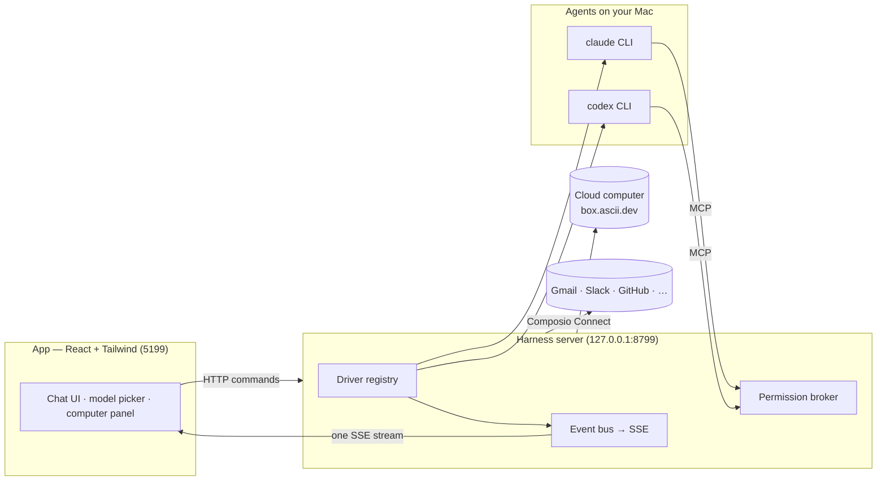

> ⚠️ **No affiliation with any cryptocurrency.** OpenMausBot has no token. Any coin using the OpenMausBot, Maus, or SupaMaus name is not created, endorsed, or affiliated with this project or its maintainer. I have received no tokens, payment, or allocation from anyone, and I will not be endorsing any token.

<div align="center">

# OpenMausBot

**Your own team of AI bots, in a chat app.**

<sub>An open-source version of **Grok Bot** — bring-your-own-agent, local-first, on the models you already have.</sub>

Every bot in the sidebar is a real agent — Claude or Codex running locally under the hood — with its own
personality, its own model, its own cloud computer, and its own connected apps.
Talk to them like contacts. Watch them work. Approve what matters.


<br>

<a href="https://github.com/milind-soni/openmausbot-releases/releases/latest/download/OpenMausBot.dmg">
  
</a>
&nbsp;
<a href="https://github.com/milind-soni/openmausbot-releases/releases/latest/download/OpenMausBot-setup.exe">
  
</a>

<sub>macOS: Apple silicon · signed & notarized · one-click .dmg &nbsp;·&nbsp; Windows: 64-bit · one-click installer, no admin rights &nbsp;·&nbsp; both always the latest · [all releases](https://github.com/milind-soni/openmausbot-releases/releases)</sub>

<br>
<br>


</div>

---

## Why

One assistant in one box is the wrong shape for agents. OpenMausBot is an open-source take on **Grok Bot** —
it keeps the idea (AI as a *messaging app*: a roster of bots you chat with, each with its own personality,
memory of its thread, model, computer, and apps) and rebuilds it open, local-first, and on the agents you
already have:

- **Bring your own agents and models.** Bots can run on the `claude`, `codex`, and `grok` CLIs installed on
  your computer, or use OpenRouter, Ollama Cloud, local Ollama, vLLM, and other OpenAI-compatible servers.
- **Local first.** One small harness server on `127.0.0.1` owns every agent process. Transcripts, keys, and
  events live in `~/.openmausbot`, not a cloud.
- **Agents with hands.** Each bot can get a real computer — a cloud Linux desktop it drives while you watch
  live, or your own Mac — plus 500+ apps through Composio Connect.

## Features

<table>
<tr>
<td width="50%" valign="top">

### 🧠 Pick a brain per bot

A searchable model picker with a provider rail — CLI agents and live API catalogs side by side, defaults
marked, unavailable providers dimmed with the reason. Switch a bot's model mid-conversation.


</td>
<td width="50%" valign="top">

### 🖥️ Every bot gets a computer

Open the Computer panel and the bot's cloud desktop spins up on its own — live screen preview while it
works, "Open desktop" to take over in your browser, or point the bot at *this Mac* instead.


</td>
</tr>
<tr>
<td width="50%" valign="top">

### 🙋 Bots ask before they act

Shell commands, file edits, and questions surface as inline cards — Allow / Deny / answer in chat. A
permission broker turns every risky action into a decision you make, for cloud and local computers alike.


</td>
<td width="50%" valign="top">

### 🔌 Connected apps

A one-click marketplace over Composio Connect: Gmail, Slack, GitHub, Notion, Linear and hundreds more.
OAuth once, and every bot can use them as tools.


</td>
</tr>
<tr>
<td width="50%" valign="top">

### 🗂 Manage bots like chats

Right-click any bot: pin, mark unread, edit profile, duplicate, copy conversation ID, hide, delete. It's a
messaging app — your agents behave like contacts.


</td>
<td width="50%" valign="top">

### 🔑 Keys once, everything lights up

Paste credentials in App Settings — they persist locally and the provider fleet hot-reloads instantly.
Secrets are write-only: the UI only ever sees "configured" flags.


</td>
</tr>
</table>

**Also in the box:** streaming replies with tool-run activity chips · native macOS dictation from the
composer mic (on-device Apple speech recognition — desktop app) · SupaMaus cursor mascots with role-aware
expressions · screenshots of the bot's work folded into the transcript · generated images and videos
rendered directly in chat · side-by-side previews for generated HTML artifacts.

## How it works

Two processes. The app holds no transports of its own — it sends typed commands over HTTP and folds one SSE
event stream into state. The harness server owns every agent process and normalizes each provider's native
protocol into one canonical runtime event stream (logged per-thread as NDJSON).



| Layer | Where | What it does |
|---|---|---|
| Drivers | `server/drivers/` | Claude, Codex, and Grok Build over local CLIs, plus OpenRouter, Ollama Cloud, generic OpenAI-compatible APIs, and a cloud-computer agent. Unknown drivers degrade to "unavailable", never crash the fleet. |
| Harness | `server/harness/` | Registry (configs → live instances) and the fan-in event bus every client folds. |
| API | `server/index.ts` | Bots, turns, approvals, model catalog, computer lifecycle, connectors, config — HTTP + SSE. |
| App | `src/` | The chat shell. Server-backed store, one reducer, zero client-side transports. |
| Desktop | `electron/` | macOS + Windows shells: dictation helper (SFSpeechRecognizer, macOS only), local screen capture, CUA bridge (macOS only). |

## Quick start

**Easiest:** grab the build for your machine — the harness server is embedded, so there's no setup either way.

| | Download | Install |
|---|---|---|
| **macOS** (Apple silicon) | [OpenMausBot.dmg](https://github.com/milind-soni/openmausbot-releases/releases/latest/download/OpenMausBot.dmg) | Drag it to Applications, open it. Signed & notarized. |
| **Windows** (x64) | [OpenMausBot-setup.exe](https://github.com/milind-soni/openmausbot-releases/releases/latest/download/OpenMausBot-setup.exe) | Run it — one-click, per-user, no admin rights. The installer isn't code-signed yet, so SmartScreen shows "unknown publisher": **More info → Run anyway**. |

**From source:**

```sh
git clone https://github.com/milind-soni/OpenMausBot && cd OpenMausBot
pnpm install

pnpm dev:server    # harness server → 127.0.0.1:8799
pnpm dev           # app → http://127.0.0.1:5199
pnpm dev:desktop   # or the Electron shell
```

Requirements: **macOS or Windows**, **Node 24+**, **pnpm**, and either an agent CLI —
[`claude`](https://claude.com/claude-code), [`codex`](https://github.com/openai/codex), or
[`grok`](https://x.ai/cli) — or one of the model API connections below. Available providers appear in the
model picker automatically.

Optional, pasted once in **App Settings** (gear in the sidebar footer):

| Key | Unlocks |
|---|---|
| OpenRouter API key (`sk-or-…`) | OpenRouter's live model catalog |
| Ollama API key | Direct Ollama Cloud models |
| OpenAI-compatible endpoint + optional bearer token | Local/LAN/remote Ollama, vLLM, or another compatible server |
| Composio Connect key (`ck_…`) | The connected-apps marketplace |
| Composio API key (`ak_…`) | The full 500+ app catalog with official logos |
| Box token ([box.ascii.dev](https://box.ascii.dev)) | Cloud computers for your bots |

### Open models and compatible endpoints

Open **App Settings → Model providers** and choose any of these paths:

| Provider | Configuration |
|---|---|
| OpenRouter | Paste an API key. The app uses `https://openrouter.ai/api/v1` and discovers chat, image, and video catalogs automatically. |
| Ollama Cloud | Paste an Ollama API key. The app connects directly to `https://ollama.com/v1`. |
| Local Ollama | Leave the bearer token empty; use `http://127.0.0.1:11434/v1` and a pulled model such as `gpt-oss:20b`. |
| vLLM on this computer or another IP | Use `http://<host>:8000/v1`, the served model ID, and the API key only if the server was started with one. |
| Other OpenAI-compatible server | Enter its base URL ending in `/v1`, model ID, and optional bearer token. Text models use `/models` and `/chat/completions`; media paths and model tasks are configurable. |

### Generated images and videos

The model picker marks image and video generation models. Routing is automatic: select an **Image** model
and the next prompt uses image generation; select a **Video** model and it creates and tracks the provider's
asynchronous video job. There is no prompt-keyword guessing or separate generation mode.

For a bot that should chat or code with one model and create media with another, open **Bot Settings →
Model team**. Keep any chat model as the primary model, then optionally choose one image specialist and one
video specialist from any configured provider. The primary model calls the appropriate specialist when the
conversation needs media, so the same bot can combine local Ollama or vLLM for text with OpenRouter media
models without manual model switching.

Generated images appear inline with copy, download, and a larger viewer. Videos appear as native players
with seeking and download controls. Long-running video jobs stay visible in the transcript with their live
status. Completed assets are validated and copied to `~/.openmausbot/media` so signed provider links can
expire without breaking the conversation. The default safety limits are 25 MiB per image and 512 MiB per
video; unsafe file signatures, oversized responses, and untrusted private-network redirects are rejected.

OpenRouter uses its dedicated `/images`, `/images/models`, `/videos`, and `/videos/models` APIs. For another
OpenAI-compatible service, the defaults are `/images/generations` and `/videos`. If its `/models` response
does not declare output modalities, add overrides in **App Settings → Model providers**, one per line:

```text
stable-diffusion-xl=image
wan-2.2=video
local-assistant=chat
```

Local Ollama and regular vLLM models remain text/chat models unless their server reports a media output or
you explicitly assign a task. Custom image/video route paths can be changed in the same settings panel.

### HTML artifacts

A completed fenced block labeled `html`, `htm`, or `html_preview` automatically opens in a resizable
side-by-side preview workspace. While HTML is streaming, its compact code card can be expanded without
interrupting generation. The code stays in the chat with **Open/Reopen**, and **Open artifact** in the chat
header restores the latest preview after it is closed. The workspace adds refresh, copy, download, and close
controls. Each conversation remembers its open artifact and the app remembers the chosen panel width. On
narrow windows, the preview uses the full window.

Artifact scripts run in a sandboxed opaque-origin iframe without access to the OpenMausBot document,
Electron APIs, forms, popups, downloads, or top-level navigation. Explicit HTTP(S) assets in generated HTML
can still access the network, which is indicated in the preview toolbar.

For local Ollama, pull a model first:

```sh
ollama pull gpt-oss:20b
```

For a LAN vLLM host, a typical server command is:

```sh
vllm serve NousResearch/Meta-Llama-3-8B-Instruct --host 0.0.0.0 --api-key your-lan-token
```

Then configure `http://<that-computer-ip>:8000/v1`, the exact served model ID, and `your-lan-token`.
Use HTTPS rather than plain HTTP when the endpoint crosses an untrusted network.

The equivalent environment variables are `OPENROUTER_API_KEY`, `OLLAMA_API_KEY`,
`OPENAI_COMPATIBLE_BASE_URL`, `OPENAI_COMPATIBLE_MODEL`, and the optional
`OPENAI_COMPATIBLE_API_KEY`.

```sh
pnpm typecheck     # app + server
pnpm build         # typecheck + production build
pnpm package:win   # Windows installer + zip → release/
```

## Status

Early but real — the loop works end to end: message → agent → streamed reply → tools → approvals →
computer use. Rough edges to expect: routines (scheduled tasks) are a placeholder, sidebar sections aren't
built yet, and the Linux shell hasn't been attempted (macOS and Windows both run end to end; the harness
itself is portable Node).

Contributions welcome — the driver SPI in [`server/contracts.ts`](server/contracts.ts) is deliberately
small; adding a provider is one file in [`server/drivers/`](server/drivers/) plus a one-line registration.

## License

[MIT](LICENSE) © 2026 Milind Soni and contributors.

OpenMausBot is an independent, open-source project inspired by Grok Bot. It is
not affiliated with, endorsed by, or associated with xAI; "Grok" is a trademark
of its respective owner.
