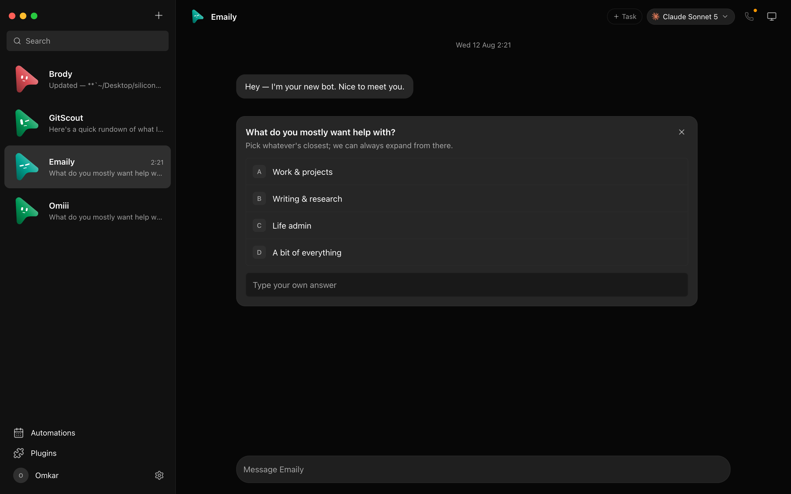
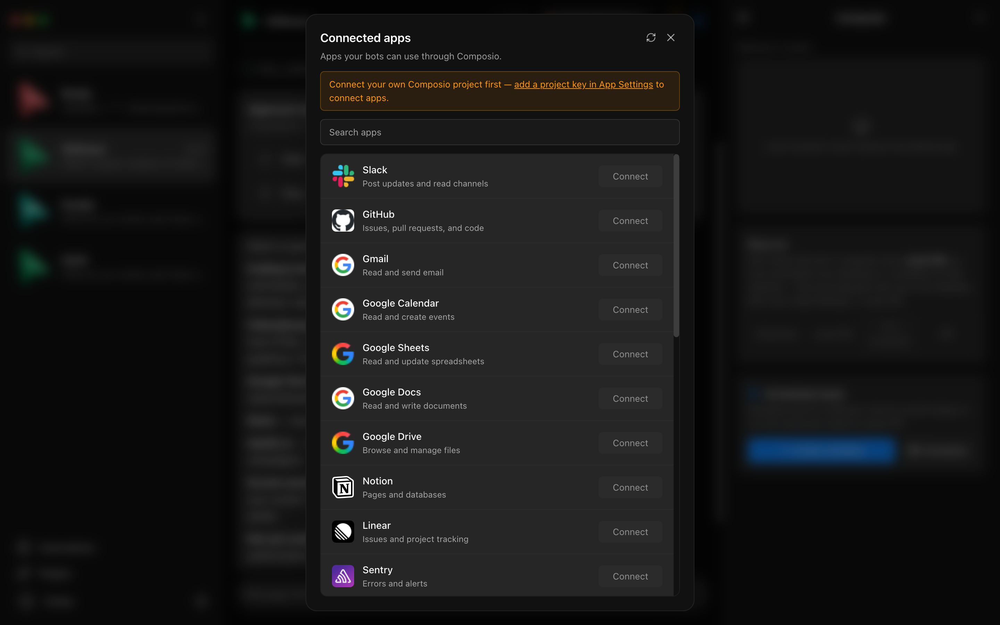
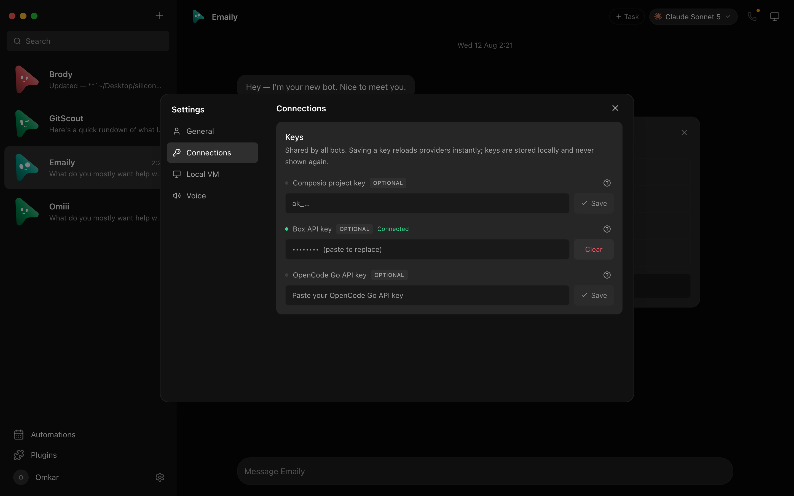
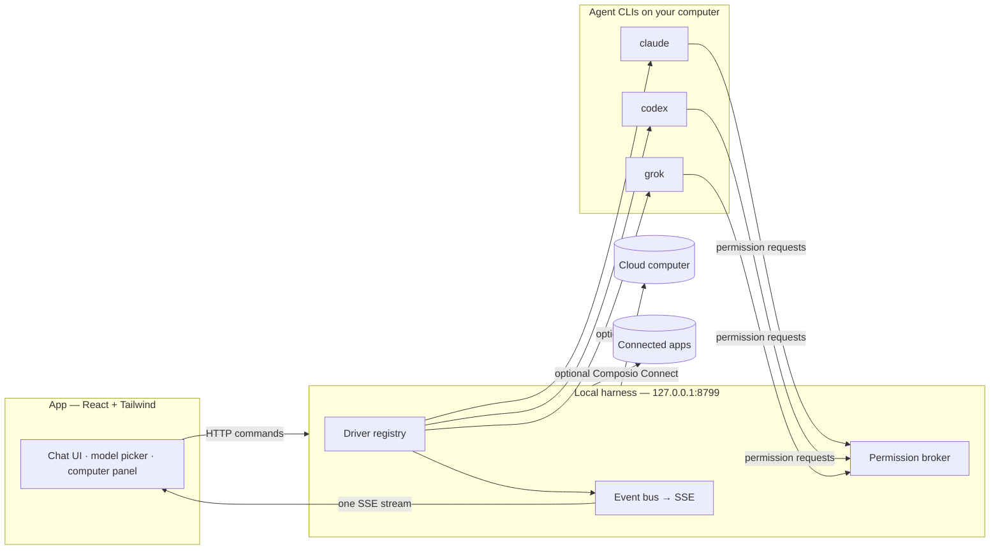

> [!WARNING]
> **OpenMausBot has no cryptocurrency or token.** Coins using the OpenMausBot, Maus, or SupaMaus name are not created, endorsed, or affiliated with this project or its maintainer. The maintainer has received no tokens, payment, or allocation and will not endorse any token.

<div align="center">

# OpenMausBot

**A local-first chat app for running a team of AI agents.**

Give each bot its own role, model, computer, and connected apps. Talk to it like a contact, watch it work, and approve sensitive actions before they run.

[Website](https://openmausbot.vercel.app/) · [Documentation](#how-it-works) · [Contributing](CONTRIBUTING.md) · [Releases](https://github.com/milind-soni/openmausbot-releases/releases)


<br>

<a href="https://github.com/milind-soni/openmausbot-releases/releases/latest/download/OpenMausBot.dmg">
  
</a>
&nbsp;
<a href="https://github.com/milind-soni/openmausbot-releases/releases/latest/download/OpenMausBot-setup.exe">
  
</a>

<sub>macOS: Apple silicon, signed and notarized · Windows: x64, per-user installer · [View all releases](https://github.com/milind-soni/openmausbot-releases/releases)</sub>

<br><br>


</div>

## What is OpenMausBot?

OpenMausBot is an open-source take on the idea behind Grok Bot: AI agents presented as a messaging app instead of a single assistant in a single box.

Each bot is a real agent process powered by a CLI already installed on your computer. It keeps its own conversation, can use a local or cloud computer, and can connect to tools such as Gmail, Slack, GitHub, Notion, and Linear.

- **Bring your own agents.** Use the `claude`, `codex`, or `grok` CLI with your existing login or subscription. Local CLI bots use those existing provider sessions; OpenMausBot does not sell model access.
- **Local-first by default.** The harness listens on `127.0.0.1`; transcripts, credentials, and events are stored under `~/.openmausbot`.
- **Review permission requests in chat.** Supported provider permission requests and agent questions appear as inline approval cards.
- **Add computers and apps when you need them.** Bots can use a supported Mac, an optional remote Linux desktop, and services from the Composio catalog.

## Install

Released desktop builds include the harness server, so there is no separate server to configure. You still need at least one supported agent CLI installed and signed in.

| Platform | Download | Notes |
|---|---|---|
| **macOS** | [OpenMausBot.dmg](https://github.com/milind-soni/openmausbot-releases/releases/latest/download/OpenMausBot.dmg) | Apple silicon. Drag to Applications and open. Signed and notarized. |
| **Windows** | [OpenMausBot-setup.exe](https://github.com/milind-soni/openmausbot-releases/releases/latest/download/OpenMausBot-setup.exe) | Windows x64. Per-user install; no admin rights required. The installer is not code-signed yet, so SmartScreen may show **Unknown publisher**. Choose **More info → Run anyway**. |
| **Ubuntu Desktop** | Build from source | Ubuntu 24.04 x64 is in beta. See the [Ubuntu Desktop guide](docs/linux-desktop.md). |

You also need at least one supported agent CLI installed and logged in:

- [Claude Code](https://claude.com/claude-code)
- [OpenAI Codex](https://github.com/openai/codex)
- [Grok CLI](https://x.ai/cli)

Available CLIs appear in the model picker automatically.

### Run from source

Requirements: **Node.js 24+**, **pnpm**, and macOS, Windows, or Ubuntu 24.04 x64.

```sh
git clone https://github.com/milind-soni/OpenMausBot.git
cd OpenMausBot
pnpm install

pnpm dev:server    # harness server → 127.0.0.1:8799
pnpm dev           # web app → 127.0.0.1:5199
pnpm dev:desktop   # Electron shell; keep the two commands above running
```

## Features

<table>
<tr>
<td width="50%" valign="top">

### 🧠 Choose a model per bot

Use Claude, Codex, and Grok models side by side. Switch a bot's model without starting a new conversation.


</td>
<td width="50%" valign="top">

### 🖥️ Give a bot a computer

Watch a cloud desktop live, take over in your browser, or let a supported bot work on your Mac.


</td>
</tr>
<tr>
<td width="50%" valign="top">

### 🙋 Review permission requests

Allow or deny permission requests surfaced by supported provider integrations, and answer agent questions without leaving the conversation. Approvals are a consent layer, not a sandbox; local agents run with your user account's privileges.



</td>
<td width="50%" valign="top">

### 🔌 Connect the apps you use

Expose services such as Gmail, Slack, GitHub, Notion, and Linear to bots through the optional Composio Connect integration.



</td>
</tr>
<tr>
<td width="50%" valign="top">

### 🗂 Manage agents like contacts

Pin, duplicate, hide, or delete bots. Each bot keeps its own profile and conversation.


</td>
<td width="50%" valign="top">

### 🔑 Configure credentials once

Credentials are stored unencrypted in the local OpenMausBot configuration and hot-reloaded. The API returns configuration status, not saved secret values.



</td>
</tr>
</table>

### Voice, calls, routines, and webhooks

Use ElevenLabs to read replies aloud or give each bot a voice. On macOS, call mode combines ElevenLabs with on-device Apple speech recognition so a bot can narrate its work and ask for approval out loud. See [Voice mode](docs/voice-mode.md) for current limitations.

Routines run once or on selected weekdays using a bot's configured model and computer. Webhook triggers use the same queued task runner and can start work from another service. The local webhook receiver listens on `127.0.0.1:8800` by default and exposes only `/health` plus secret hook URLs. OpenMausBot must remain running to receive deliveries.

## How it works

The React app sends commands over HTTP and folds one SSE event stream into local state. A harness server owns every agent process, normalizes each provider's native protocol, brokers approvals, and records thread events as NDJSON.



| Layer | Location | Responsibility |
|---|---|---|
| Drivers | `server/drivers/` | Adapt provider CLIs and ACP/JSON-RPC protocols to one runtime contract. Unknown drivers become unavailable instead of crashing the fleet. |
| Harness | `server/harness/` | Own live agent instances and fan events into one bus. |
| API | `server/index.ts` | Expose bots, turns, approvals, models, computers, connectors, and config over HTTP + SSE. |
| Voice | `server/tts/` | Call ElevenLabs without exposing its key to the UI, and rewrite markdown for speech. |
| App | `src/` | Render the chat shell and fold server events through one reducer. |
| Desktop | `electron/` | Package the app with platform capabilities and an embedded harness. |

## Data, security, and third-party services

Local-first describes where OpenMausBot stores its application data, not wholly offline operation:

- **Local harness.** The main API binds to `127.0.0.1` and has no application-level authentication. It trusts the local user and must not be exposed to a network.
- **Local files.** Bot state, transcripts, runtime events, and configuration are stored under `~/.openmausbot`.
- **Credentials.** Saved integration keys are stored unencrypted in `~/.openmausbot/config.json`. On POSIX systems, OpenMausBot writes the file with owner-only permissions. The API returns only `configured` flags, not stored values.
- **Agent privileges.** Local CLIs run with your operating-system user's privileges. The permission broker is a consent boundary, not process isolation.
- **External services.** Prompts and tool activity may be sent to the provider behind your selected CLI. Box, Composio, and ElevenLabs receive data when their optional features are used.
- **Usage analytics.** OpenMausBot sends named product-usage events to PostHog. Automatic element and page-view capture are disabled. If you submit an email during onboarding, it identifies the PostHog record; skipping the email does not disable anonymous usage events.
- **Security reports.** Do not open a public issue for a vulnerability. Follow the private reporting instructions in [SECURITY.md](SECURITY.md).

Optional services have their own data handling, accounts, terms, and pricing:

| Service | Purpose | Required? |
|---|---|---|
| Agent CLI provider | Generates model responses using your existing CLI login or subscription | At least one is required |
| [Composio Connect](https://docs.composio.dev/docs/composio-connect) | Connects external apps such as Gmail, GitHub, and Slack | Optional |
| [Box](https://docs.ascii.dev/box/api-keys) | Provides a remote Linux computer | Optional; paid after its trial |
| [ElevenLabs](https://elevenlabs.io/app/settings/api-keys) | Reads replies aloud and powers bot voices | Optional |

Credentials can be added in **App Settings**. Local chat works without Composio, Box, or ElevenLabs.

## Platform capabilities

| Capability | macOS | Windows x64 | Ubuntu 24.04 x64 |
|---|---|---|---|
| Packaged app with embedded harness | Supported | Supported | Beta |
| Local agent CLIs | Supported | Supported | Beta |
| Composio and cloud computers | Supported | Supported | Beta |
| Local screen preview and computer control | Supported on current macOS builds | Unavailable | Unavailable |
| Native dictation and call input | Apple Speech; on-device where supported | Unavailable | Unavailable |

Unavailable native features fail closed without blocking chat or cloud features. Linux local computer control, Wayland capture and automation, dictation, and ARM64 are tracked in [#29](https://github.com/milind-soni/OpenMausBot/issues/29).

## Development

```sh
pnpm typecheck       # app + server TypeScript
pnpm test            # unit, driver, API, and updater tests
pnpm build           # typecheck + production build
pnpm check:electron  # syntax-check Electron main/preload files
```

Package desktop builds:

```sh
pnpm package:mac      # macOS: DMG + ZIP; requires Swift/Xcode tools
pnpm package:win      # Windows: installer + ZIP
pnpm package:linux    # Ubuntu x64: .deb + AppImage
```

See [CONTRIBUTING.md](CONTRIBUTING.md) before opening a pull request. The provider SPI in [`server/contracts.ts`](server/contracts.ts) is intentionally small; a new provider is usually one driver plus one registration.

## Project status

OpenMausBot is early but functional: messages stream from real agent processes, tools request approval, and bots can use connected apps and computers. Expect rough edges. Hosted and mobile connectivity are still being developed, Linux desktop support is in beta, and webhooks currently require the local app to remain online.

## License and attribution

[MIT](LICENSE) © 2026 Milind Soni and contributors.

OpenMausBot is an independent, open-source project inspired by Grok Bot. It is not affiliated with, endorsed by, or associated with xAI. “Grok” is a trademark of its respective owner.
